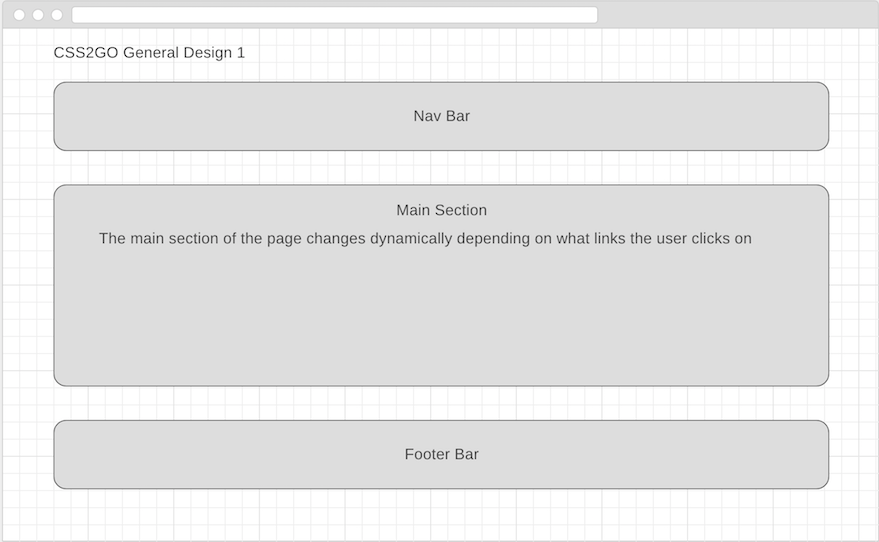
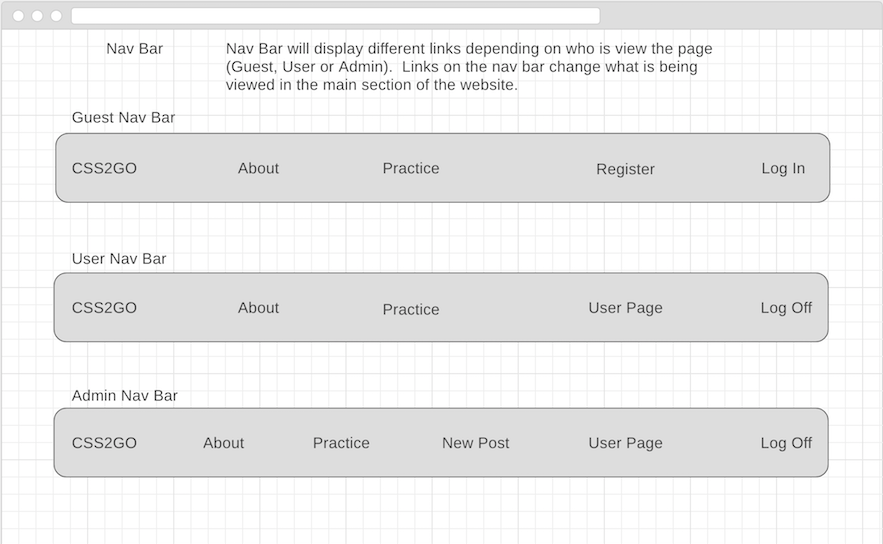
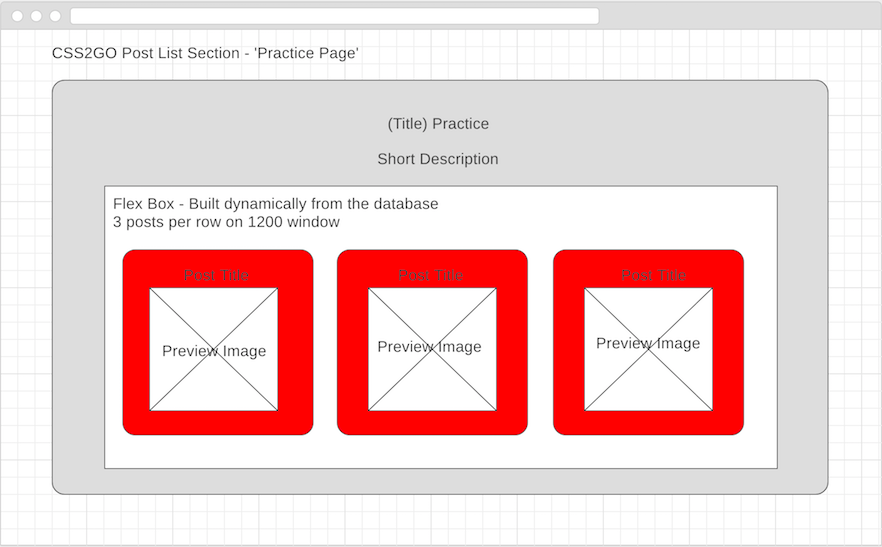
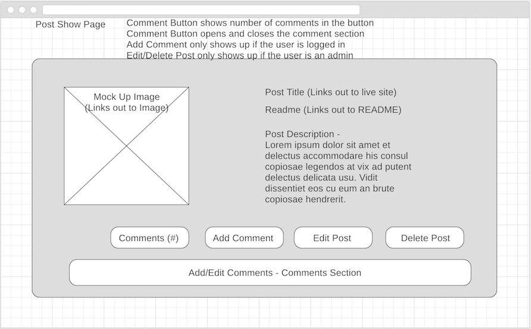
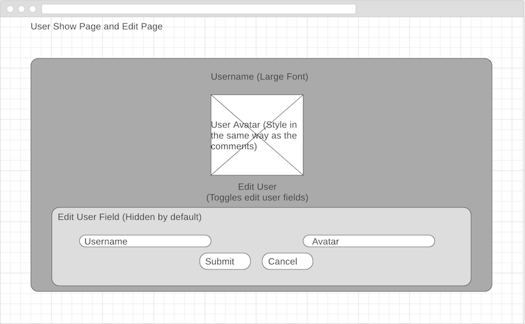

# <a href="https://css2go.herokuapp.com/">CSS2GO</a>
A project by John Kusching

<h3>Index</h3>

<ol>
<li><a href="#summary">Summary</a></li>
<li><a href="#built">Built With</a></li>
<li><a href="#wire">Wire Frames</a></li>
<li><a href="#user">User Stories</a></li>
<li><a href="#challenges">Challenges</a></li>
<li><a href="#future">Future Additions</a></li>
<li><a href="#links">Links</a></li>
</ol>

<h3>Summary</h3>

CSS2GO was built to help me practice my CSS.  The idea is to create a place to host all my smaller practice sites.  Originally I was going to use other live sites (sites that are not mine) to link to and create mock ups.  I was also going to allow users to submit their own links to the mock up.  I discarded this idea in favor of creating everything myself.  Create several small projects and one full mock up (every now and then) as a combination of the previous smaller projects.  The final version now allows everyday users to view a preview of the mock up, the readme/code as well as a live link.  Users can also post their thoughts or comments on the mock ups.

<h3>Built With</h3>
Javascript, Node.js, MongoDB, Mongoose, Express, EJS/CSS, AngularJS, Pure Dedication

<h2>Wire Frames</h2>

<h3>General Design</h3>

<h3>Navigation Bar</h3>

<h3>Practice Section</h3>

<h3>Post Show</h3>

<h3>User Page</h3>

<!-- <h3>Redesign</h3>
https://wireframe.cc/9xx3c1 -->

<h2>User Stories</h2>
<ul>
<li>As a Guest...</li>
<ul>
<li>...I can browse the post listing on the website.</li>
<li>...I can click on a post to see more details about the post.</li>
<li>...I can view comments on the a post.</li>
<li>...I can register as a new user.</li>
<li>...I can log in as a returning user.</li>
</ul>
<li>As a (logged in) User...</li>
<ul>
<li>...I can do everything a Guest can do.</li>
<li>...I can edit my user name or my avatar.</li>
<li>...I can add comments to posts.</li>
<li>...I can edit and delete my own comments on a post,</li>
</ul>
<li>As an Admin User...</li>
<ul>
<li>...I can do everything a (logged in) User can do.</li>
<li>...I can create new posts.</li>
<li>...I can edit and delete old posts.</li>
<li>...I can edit and delete anyone's comments.</li>
</ul>
</ul>

<h2>Challenges</h2>

<h2>Future Additions</h2>

(Completed)

<!-- 
Create a site to add 'posts'
 -->

<h2>Links</h2>
<ul>
<li><a href="https://css2go.herokuapp.com/">CSS2GO</a></li>
<li><a href="http://kusching.com/#home">Portfolio</a></li>
<li><a href="https://github.com/johnzxcvbnm">GitHub</a></li>
<li><a href="https://www.linkedin.com/in/kusching/">LinkedIn</a></li>
</ul>
